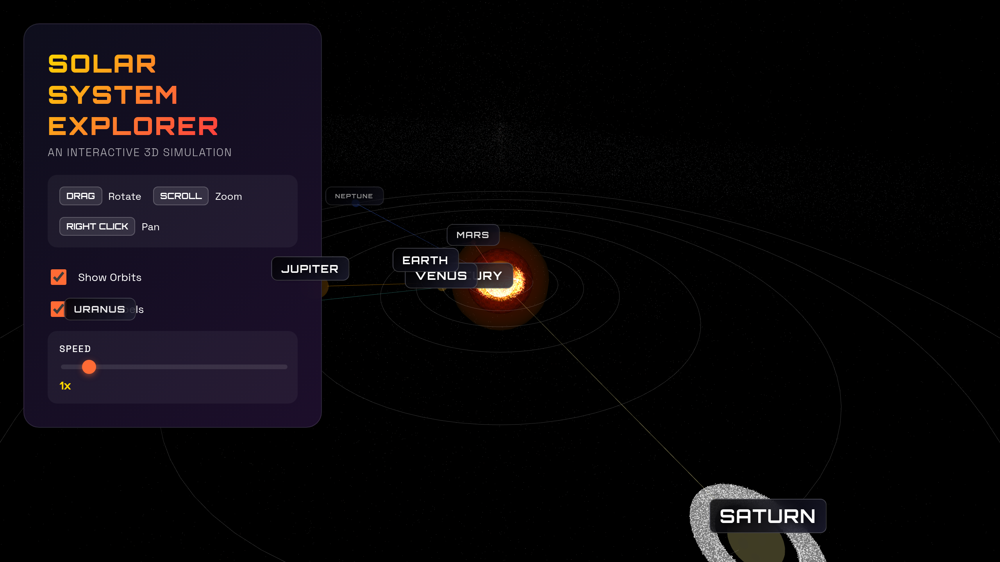
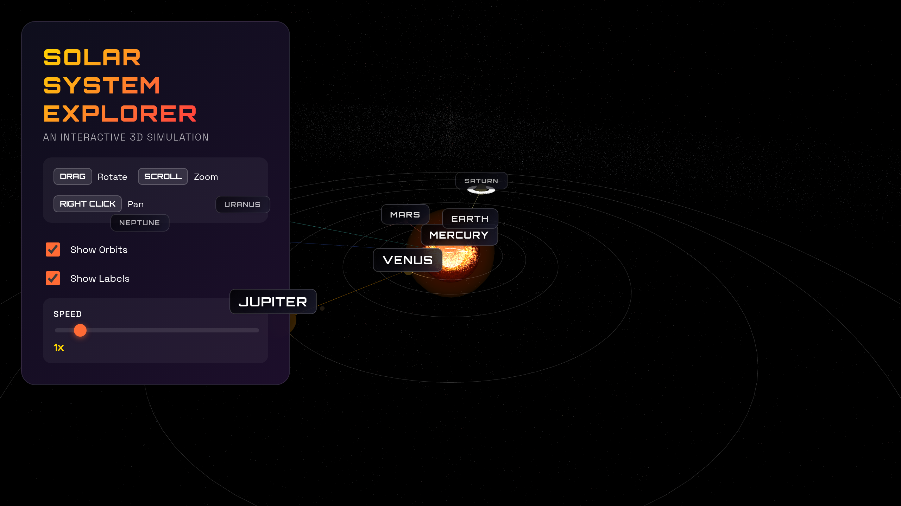
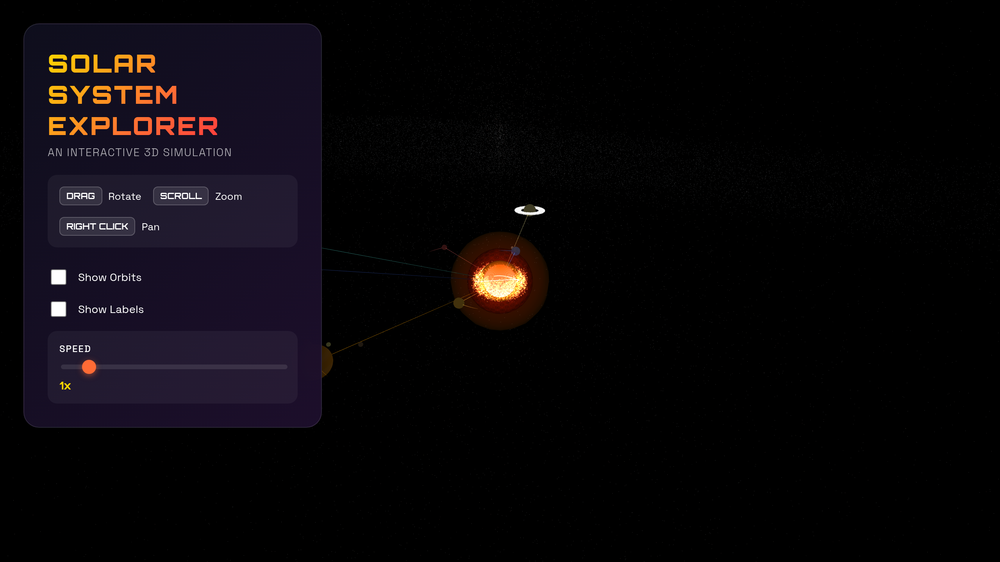

# Solar System Explorer 🌌

An advanced interactive 3D solar system simulation with realistic physics, immersive audio, and stunning visual effects. Experience space exploration like never before!

<p align="center">
  
</p>

<p align="center">
  <a href="#-key-features">Features</a> •
  <a href="#-whats-new">What's New</a> •
  <a href="#-quick-start">Quick Start</a> •
  <a href="#-controls">Controls</a> •
  <a href="#-screenshots">Screenshots</a> •
  <a href="#-technical-details">Technical</a>
</p>

---

## 🌟 Key Features

### Visual Effects
- 🌞 **Dynamic Sun** - Multi-layered shaders with plasma ejections and corona loops
- 🪐 **All 8 Planets** - With atmospheric effects for Earth, Venus, and Mars
- ☄️ **Halley's Comet** - Realistic orbital mechanics with dynamic tail effects
- 🌌 **35,000+ Stars** - Multi-layered starfield with Milky Way effect
- 💫 **Asteroid Belt** - 3,000 asteroids between Mars and Jupiter
- 🌍 **Atmospheric Effects** - Blue glow for Earth, thick clouds for Venus

### Interactive Features
- 🚀 **First-Person Camera** - Ride along with any planet or comet
- 🗺️ **Real-time Minimap** - Click to navigate anywhere in the solar system
- 📸 **Photo Mode** - Hide UI and apply filters for perfect screenshots
- 🔊 **Immersive Audio** - Outer Wilds-inspired ambient soundscape
- 📅 **Time Controls** - See planetary positions at any date
- 📊 **Planet Info Panel** - Real-time data about selected celestial bodies

## 🎉 What's New

### Latest Features
- **Atmospheric Effects** - Realistic atmospheres with rim lighting
- **Photo Mode** - Professional screenshot capabilities with filters
- **Ambient Audio** - Three-layer soundscape inspired by Outer Wilds
- **Minimap Navigation** - Top-down view with clickable navigation
- **Time Simulation** - Track real dates and jump forward in time
- **Planet Information** - Detailed facts and real-time statistics

## Screenshots

### Immersive Views

<p align="center">
  
  
</p>

<p align="center">
  <em>Experience the solar system with full controls or minimal UI</em>
</p>

## 🚀 Quick Start

### Installation

1. Clone the repository
```bash
git clone https://github.com/yourusername/threejs-experiments.git
cd threejs-experiments
```

2. Install dependencies
```bash
npm install
```

3. Start the development server
```bash
npm run dev
```

4. Open `http://localhost:5173` in your browser

## 🎮 Controls

### Navigation
| Control | Action |
|---------|--------|
| **Left Mouse** | Rotate camera |
| **Scroll** | Zoom in/out |
| **Right Mouse** | Pan camera |
| **Minimap Click** | Jump to location |

### Keyboard Shortcuts
| Key | Action |
|-----|--------|
| **P** | Take screenshot (in Photo Mode) |
| **ESC** | Exit Photo Mode |

### Camera Modes
- **Free Camera** - Full control of camera movement
- **Planet Ride** - Follow any planet in its orbit
- **Comet Ride** - Chase Halley's Comet through space
- **Solar Orbit** - Circle around the Sun

### UI Controls
- ✅ **Show Orbits** - Toggle orbital paths
- ✅ **Show Labels** - Toggle planet names
- ✅ **Show Asteroids** - Toggle asteroid belt
- 🔊 **Enable Sound** - Toggle ambient audio
- 🎚️ **Speed Control** - Adjust time from 0-10x
- 📅 **Time Jump** - Skip ahead by months or years
- 📸 **Photo Mode** - Professional screenshot mode

## 📊 Technical Details

### Technologies
- **Three.js** - Advanced 3D graphics with WebGL
- **Web Audio API** - Real-time audio synthesis
- **Custom Shaders** - GLSL shaders for visual effects
- **Vite** - Lightning-fast development environment

### Advanced Features

#### 🌟 Visual Systems
- **Multi-layered Rendering**
  - Sun with 4 shader layers
  - 35,000+ stars in 3 depth layers
  - Dynamic particle systems
  
- **Atmospheric Shaders**
  - Rim lighting effects
  - Real-time cloud generation
  - Distance-based opacity

#### 🎵 Audio System
- **Three-Layer Soundscape**
  - Deep space ambience (50-880Hz)
  - Solar wind (pink noise)
  - Planetary resonance (pentatonic scale)
  
- **Dynamic Audio**
  - Distance-based volume
  - Proximity effects
  - 4-second reverb

#### ⚡ Performance
- **Optimizations**
  - Instanced rendering for asteroids
  - LOD system for stars
  - Efficient particle recycling
  - Smart label updates

### Project Structure

```
threejs-experiments/
├── index.html              # Modern UI with glassmorphism
├── solar-system.js         # Core simulation (2600+ lines)
├── solar-style.css         # Advanced styling with animations
├── capture.js              # Screenshot automation
├── package.json            # Dependencies
├── vite.config.js          # Build configuration
└── screenshots/            # Sample images
```

## 🛠️ Development

### Customization

```javascript
// Add new planets
const planetData = [{
  name: 'YourPlanet',
  radius: 10,
  distance: 500,
  color: 0xff0000,
  // ... more properties
}];

// Adjust audio volume
audioNodes.ambient.gains[3].gain.value = 0.1;

// Change particle count
const asteroidCount = 5000; // Default: 3000
```

### Building for Production

```bash
npm run build
npm run preview
```

## 🖥️ System Requirements

### Minimum
- Modern browser with WebGL 2.0
- 4GB RAM
- Integrated graphics

### Recommended
- Chrome/Firefox latest
- 8GB RAM
- Dedicated GPU
- Hardware acceleration enabled

## 🤝 Contributing

Contributions are welcome! Please feel free to submit a Pull Request.

## 📄 License

This project is open source and available under the MIT License.

## 🙏 Acknowledgments

- **Three.js** community for the amazing library
- **Outer Wilds** for audio inspiration
- **NASA** for planetary data
- **Space enthusiasts** everywhere! 🚀

---

<p align="center">
  Made with ❤️ and Three.js | Star ⭐ this repo if you enjoyed it!
</p>